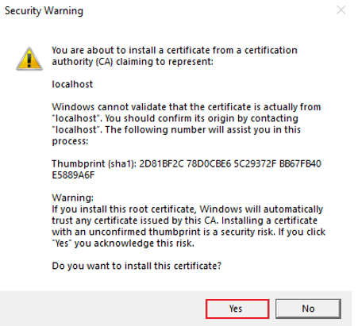

# Mise en place du labo

Effectuez les tâches suivantes pour préparer votre environnement de développement avant de terminer les labos.

## Prérequis pour le labo

Vous avez besoin des outils suivants pour terminer les labos de ce cours :

- Accès administrateur à un locataire Microsoft 365.
- Un abonnement Azure.
- Visual Studio Code.
- Extension Visual Studio Code du kit de ressources Teams :  Version 5.2.0 ou supérieure. (Vous allez l’installer pendant le labo)
- Client Microsoft Teams (professionnel ou scolaire) ou accès à Microsoft Teams via un navigateur web.
- Node.js version 16.14.2.

## Installer nvm-windows

Vous utiliserez cet outil pour installer Node.js et éventuellement changer les versions de Node en fonction des besoins de vos projets.

1. Dans un navigateur web, accédez à [https://github.com/coreybutler/nvm-windows/releases](https://github.com/coreybutler/nvm-windows/releases).
2. Recherchez la dernière version de mise en production et sélectionnez le fichier **nvm-setup.zip** à télécharger.  Le fichier va être téléchargé sur votre machine.
3. Ouvrez le dossier de fichiers et **extrayez** le contenu du dossier zip dans un dossier sur votre machine.
4. Dans le nouveau dossier, sélectionnez **nvm-setup.exe** pour ouvrir le fichier d’installation.
5. Suivez les invites du programme d’installation pour installer l’outil en utilisant les options par défaut.
6. Nvm pour Windows sera installé sur votre machine.

## Installer Node.js

Installez Node.js version 16.14.2 qui est compatible avec toutes les solutions de ce cours.

1. Ouvrez l’application **Invite de commandes**.
2. Entrez la commande `nvm install 16.14.2` pour installer Node.js.
3. La sortie nvm doit confirmer que la fin de l’installation.
4. Exécutez la commande `nvm use 16.14.2` pour utiliser cette version de Node.js.
5. Exécutez la commande `node -v` pour confirmer l’installation de la version 16.14.2.

Vous avez maintenant installé et configuré Node.js version 16.14.2

## Abonnement Azure

Notez que si vous avez reçu des informations de connexion Azure, un groupe de ressources a déjà été créé pour votre utilisation.  Pour les tâches d’approvisionnement dans les labos, lorsque vous êtes invité à « sélectionner un groupe de ressources ou à créer un groupe de ressources », **sélectionnez le groupe de ressources fourni**.

## Débogage d’applications Teams

Lorsque vous déboguez votre application Teams localement, il est possible que vous soyez invité à installer un certificat de développement pour localhost.  Vous devez l’effectuer pour déboguer en local.

Quand vous y êtes invité, sélectionnez **Installer**.

Sélectionnez Ensuite **Oui** dans la boîte de dialogue Avertissement de sécurité.

Consultez la documentation pour découvrir plus d’informations : [Déboguer localement votre application Teams](https://learn.microsoft.com/microsoftteams/platform/toolkit/debug-local?tabs=Windows&pivots=visual-studio-code-v5)
