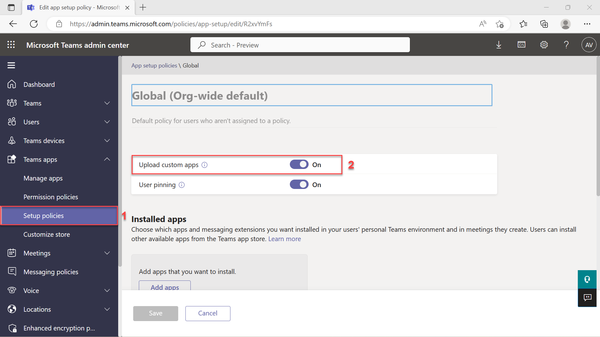

# Exercice 1 : Installer et configurer Teams Toolkit pour Visual Studio Code

Dans cet exercice, vous allez installer Teams Toolkit pour Visual Studio Code et configurer votre environnement.

## Tâche 1 : Installer Teams Toolkit pour Visual Studio Code

1. Ouvrez **Visual Studio Code**.
2. Sélectionnez l’icône **Extensions** dans la barre latérale.
3. Recherchez « Teams Toolkit » dans la section **Extensions** à l’aide de la barre de recherche. Sélectionnez **Installer**.

**Remarque** :  Les exercices de ce module utilisent Teams Toolkit v5.6.0. Veuillez noter que les versions mineures peuvent varier.

Vous pouvez également installer Teams Toolkit à partir de [Visual Studio Marketplace](https://marketplace.visualstudio.com/items?itemName=TeamsDevApp.ms-teams-vscode-extension).

## Tâche 2 : Préparer votre compte professionnel ou scolaire Microsoft 365

Si vous disposez déjà d’un accès administrateur à un compte professionnel ou scolaire Microsoft 365 adapté au développement et au test, vous pouvez utiliser ce compte pour exécuter et déboguer votre application. Veillez à utiliser un locataire dans lequel vous pouvez être sûr d’effectuer des opérations sans affecter les utilisateurs réels.

Sinon, vous pouvez créer un compte test gratuit en utilisant le [Programme pour les développeurs Microsoft 365](https://aka.ms/m365developers).  Une fois l’installation terminée, le Programme pour les développeurs Microsoft 365 vous fournira l’accès administrateur à un locataire que vous pourrez utiliser pour créer des applications Teams.

## Tâche 3 : Configurer votre locataire Microsoft 365 afin de charger des applications pour Teams

Activez le chargement d’application personnalisée pour votre locataire en effectuant ces étapes :

1. Connectez-vous au [Centre d’administration Microsoft Teams](https://admin.teams.microsoft.com) avec vos **informations d’identification d’administrateur Microsoft 365**.

2. Dans la barre latérale, sélectionnez **applications** Teams, puis sélectionnez **Stratégies de configuration**.

3. Sélectionnez la stratégie **globale (valeur par défaut à l’échelle de l’organisation)**, puis activez le bouton bascule **Charger des applications personnalisées**.

   

4. Cliquez sur le bouton **Enregistrer** pour enregistrer vos modifications. Votre locataire est maintenant configuré pour autoriser le chargement indépendant d’applications personnalisées.

Dans l’unité suivante, vous allez découvrir comment créer une application Teams et l’exécuter localement dans Teams.
