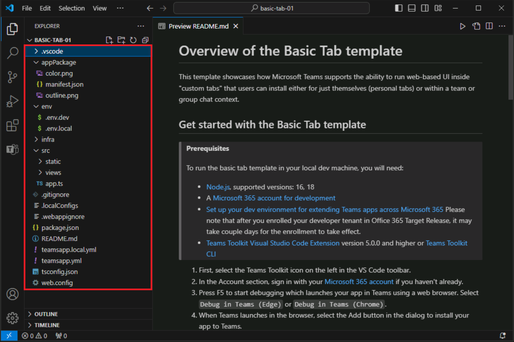

# Exercice 2 : Créer une application Teams à l’aide de Teams Toolkit

Teams Toolkit pour Visual Studio Code offre deux méthodes pour créer une nouvelle application. Vous pouvez créer une application à l’aide des modèles intégrés fournis par le kit d’outils. De plus, Teams Toolkit pour Visual Studio Code fournit également une collection d’exemples qui vous permettent d’explorer et de créer votre application de base. 

Dans cet exercice, vous créez votre première application Microsoft Teams à l’aide des modèles intégrés.

## Tâche 1 : Créer une application Teams

1. Dans la barre latérale de Visual Studio Code, sélectionnez le bouton **Teams Toolkit** pour ouvrir Teams Toolkit.
1. Dans Teams Toolkit, sélectionnez **Créer une application**.

   

1. Dans le menu Nouveau projet, sélectionnez** **Onglet**.

   
   
1. Quand vous êtes invité à sélectionner une capacité, sélectionnez **Onglet de Base**.
1. Quand vous êtes invité à sélectionner un langage de programmation, sélectionnez **TypeScript**.
1. Quand vous êtes invité à sélectionner un dossier, sélectionnez **Dossier par défaut** ou choisissez un autre emplacement de fichier.
1. **Entrez un nom d’application** de votre choix pour votre application d’onglet de base, puis sélectionnez **Entrer**.
1. Teams Toolkit génère la structure d’une nouvelle application et ouvre le dossier du projet dans Visual Studio Code.
1. Vous pouvez recevoir un message de Visual Studio Code qui vous demande si vous approuvez les auteurs des fichiers dans ce dossier. Sélectionnez le bouton **Oui, je fais confiance aux auteurs** pour continuer.

   

1. Vous pouvez maintenant voir le code du projet, qui comprend les éléments suivants :

- Code d’application Teams.
- Fichiers de déploiement et manifeste dans le dossier appPackage.
- Variables d’environnement dans le dossier env.
- Fichier README qui fournit les étapes nécessaires pour exécuter, déboguer et déployer l’application.

  
