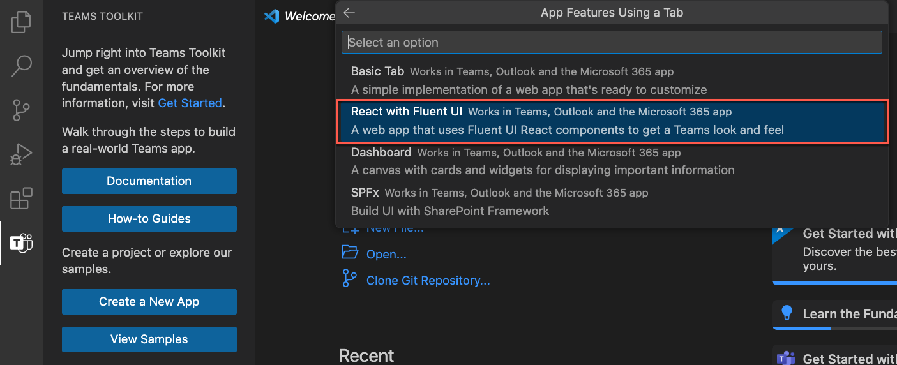
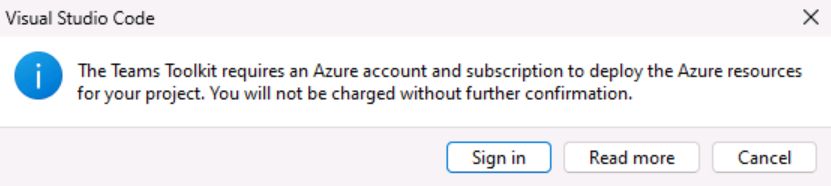

# Exercice 1 : Créer des ressources Azure pour héberger une application d’onglet Teams

Dans cet exercice, vous allez d’abord créer et approvisionner une application d’onglet Teams à l’aide du kit de ressources Teams pour Visual Studio Code. Dans un exercice ultérieur, vous allez configurer l’application à héberger dans Azure.

**Remarque** :  Les exercices de ce module d’entraînement utilisent le kit de ressources Teams v5.0.0. Les étapes suivantes supposent que l’extension du kit de ressources Teams est installée.

## Tâche 1 : Créer une application d’onglet

1. Dans Visual Studio Code, dans la barre d’activité, sélectionnez l’icône **Microsoft Teams**.

1. Dans le panneau du kit de ressources Teams, sélectionnez le bouton **Créer une application**.

1. Dans les options, sélectionnez **Onglet**.

    

1. Ensuite, sélectionnez **React avec l’interface utilisateur Fluent**.

    

1. Dans les options du langage de programmation, sélectionnez **JavaScript**.

1. Sélectionnez un **emplacement** pour le dossier de projet de l’application d’onglet et tous ses fichiers.

1. Pour le nom de l’application, entrez **hello-tab** et sélectionnez Entrée.

1. La génération de modèles automatique du projet démarre. Lorsque le projet est généré automatiquement, une nouvelle fenêtre Visual Studio Code s’ouvre avec le nouveau projet chargé.

    

1. Dans Visual Studio Code, sélectionnez **Exécuter > Démarrer le débogage** ou sélectionnez la touche **F5** pour démarrer la session de débogage.

1. Visual Studio Code génère et démarre l’application. Exécutez la session de débogage avant de commencer à approvisionner des ressources Azure.

1. Lorsque l’application est testée avec succès, arrêtez d’exécuter l’application localement.

1. Pour mettre fin à la session de débogage et arrêter l’exécution de l’application, vous pouvez fermer le navigateur, sélectionner **Exécuter > Arrêter le débogage**, ou sélectionner **Maj+F5**.

## Tâche 2 : Se connecter à Azure dans le kit de ressources Teams

Connectez-vous à Azure en utilisant le compte de votre **abonnement Azure**.

1. Dans la barre d’activité, sélectionnez l’icône **Microsoft Teams**.

1. Dans le panneau du kit de ressources Teams, sous **Comptes**, sélectionnez **Se connecter à Azure**.

    

1. Dans la boîte de dialogue qui s’affiche, sélectionnez **Se connecter**.

    

## Tâche 3 : Approvisionner les ressources

Vous pouvez maintenant approvisionner les ressources dont votre application d’onglet Teams a besoin.

1. Dans le panneau du kit de ressources Teams, sous **Cycle de vie**, sélectionnez **Approvisionner**.

    

1. Ensuite, vous devez sélectionner un groupe de ressources dans lequel vous pouvez approvisionner les ressources ou créer un groupe de ressources en sélectionnant l’option **Nouveau groupe de ressources** dans le menu **Sélectionner un groupe de ressources**.

    

1. L’outil suggère automatiquement le nom du groupe de ressources, par exemple rg-hello-tab0989fd-dev. Sélectionnez **Enter** (Entrer).

1. Ensuite, sélectionnez l’**emplacement USA Est** pour le nouveau groupe de ressources, puis sélectionnez **Entrée**.

1. Dans une boîte de dialogue permettant de confirmer votre sélection, sélectionnez **Approvisionner**.

    

1. L’approvisionnement commence pour toutes les ressources dont vous avez besoin pour héberger l’application d’onglet Teams dans Azure. L’approvisionnement peut prendre un certain temps.

Vous avez maintenant approvisionné toutes les ressources dont vous avez besoin pour héberger l’application d’onglet Teams.

Ensuite, vous allez déployer le code source de votre application sur ces ressources.
