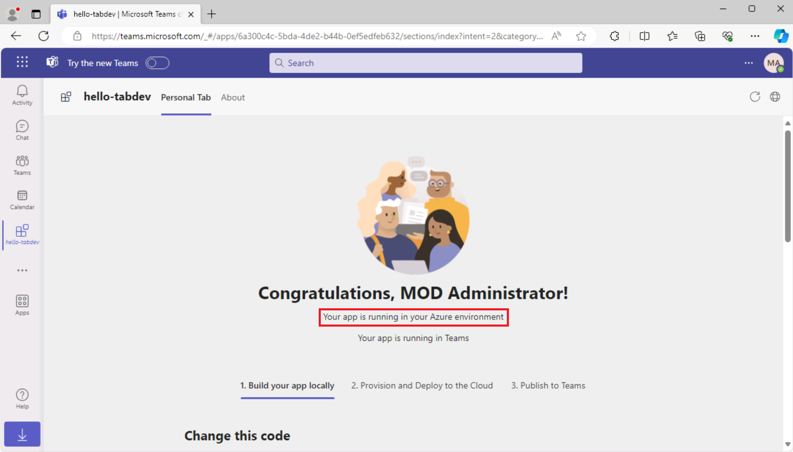

# Exercice 3 : Publier votre application d’onglet Teams

Dans cet exercice, vous apprenez à publier votre application dans le magasin de l’organisation.

## Tâche 1 : Publier votre application dans le magasin

1. Dans Visual Studio Code, sur la barre d’activité, sélectionnez l’**icône Microsoft Teams** pour ouvrir le **panneau Teams Toolkit**.

    

1. Sur le panneau Teams Toolkit, sous **Cycle de vie**, sélectionnez **Publier**.

1. Une boîte de dialogue indique que l’application a été publiée avec succès sur le portail d’administration Microsoft Teams.

1. Dans la boîte de dialogue, sélectionnez **Accéder au portail d’administration** pour ouvrir le **Centre d’administration Microsoft Teams**.  Connectez-vous avec votre **compte de locataire Microsoft 365**.

    a. 

    b. 

1. Dans le menu **Gérer les applications** du Centre d’administration Teams, repérez la zone de texte **Rechercher par nom**. 
1. Entrez **hello-tabdev** pour filtrer la liste des applications. Ensuite, **sélectionnez l’application** pour afficher les détails de l’application.

    

1. Sur le panneau des détails de l’application **hello-tabdev** , sélectionnez **Publier**.

    

1. Dans la boîte de dialogue **Publier votre application personnalisée ?**, sélectionnez **Publier**.

1. Une bannière verte indique que l’application hello-tab a été publiée.

    

Maintenant que votre application est publiée dans le magasin de l’organisation, ouvrez Microsoft Teams et installez l’application depuis le magasin de l’organisation.

## Tâche 2 : Installer l’application depuis le magasin

1. Ouvrez le client Microsoft Teams ou connectez-vous à Microsoft Teams en ligne ([teams.microsoft.com](https://teams.microsoft.com/)) avec vos **informations d’identification de locataire Microsoft 365**.
2. Dans Microsoft Teams, accédez à **Applications** pour afficher le magasin de l’organisation. Sous **Généré pour votre organisation**, sélectionnez la vignette **hello-tabdev**.

    a. 

3. Dans la boîte de dialogue d’installation de l’application, sélectionnez **Ajouter**.

    a. 

4. L’application s’ouvre et le message **Votre application s’exécute dans votre environnement Azure** s’affiche.

    
