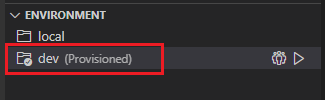
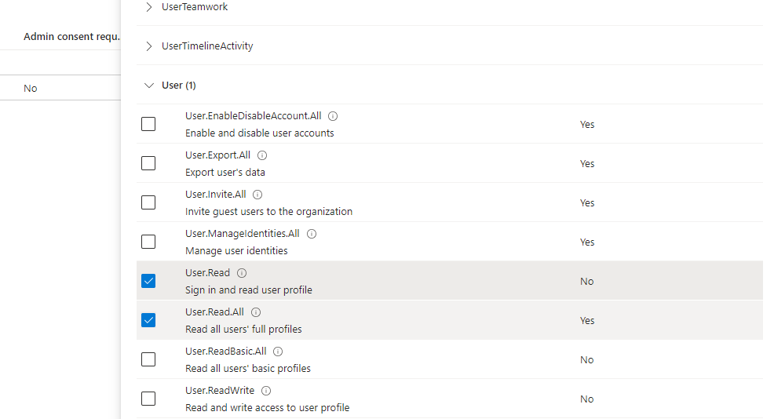
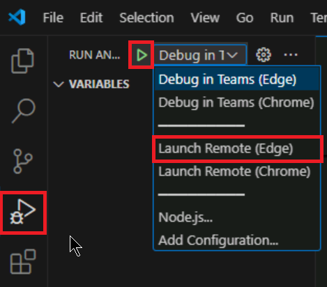

---
lab:
  title: Implémenter une extension de message qui récupère les données à partir de Microsoft Graph
  module: Exercise 1
---

# Exercice 1 : Implémenter une extension de message qui récupère les données à partir de Microsoft Graph

## Scénario

Supposons que vous ayez été invité à aider l’équipe du support informatique à créer une extension de message qui permet aux membres de l’équipe de récupérer des informations de contact pour les utilisateurs et de les insérer dans les messages dans Teams à l’aide de cartes.  Dans cet exercice, vous allez implémenter une extension de message qui récupère les données utilisateur à partir de Microsoft Graph.  La solution a déjà été générée automatiquement à l’aide de Teams Toolkit, mais vous devez apporter des modifications pour implémenter des fonctionnalités.

## Tâches de l’exercice

Votre objectif est de vous assurer que l’application dispose des fonctionnalités suivantes :


- Les utilisateurs de l’application entrent le nom d’un utilisateur dans l’interface utilisateur de l’extension de message.
- L’application utilise le point de terminaison `users` de l’API Graph pour rechercher les utilisateurs par nom d’affichage et répertorie les résultats.
- Lorsque l’utilisateur de l’application sélectionne l’utilisateur voulu dans les résultats de recherche, il peut insérer la carte souhaitée dans un message dans Teams.
- La carte contient le nom d’affichage, l’adresse e-mail et le numéro de téléphone de l’utilisateur


Vous devez effectuer les tâches suivantes dans le cadre de l’exercice :

1. Accéder au projet et le vérifier.
2. Créer la fonctionnalité de recherche
3. Ajouter les requêtes Graph
4. Provisionner des ressources pour l’extension de messagerie
5. Configurer les autorisations d’accès à Microsoft Graph
6. Déployer dans Azure
7. Exécutez et testez l’application.

**Durée prévue :** 25 minutes

## Tâche 1 : Accéder au projet et le vérifier

La structure de l’application d’extension de message a été créée à l’aide de Teams Toolkit.  L’application a également été mise à jour pour récupérer les données utilisateur de Microsoft Graph en utilisant la bibliothèque de client JavaScript Microsoft Graph.  Une partie du code est incomplète.

1. Téléchargez le projet [ContactDetails.zip](https://github.com/MicrosoftLearning/APL-4001-Build-collaborative-apps-for-Microsoft-Teams/raw/master/Allfiles/Labs/Starter/ContactDetails.zip) à partir du dossier [Starter](https://github.com/MicrosoftLearning/APL-4001-Build-collaborative-apps-for-Microsoft-Teams/tree/master/Allfiles/Labs/Starter).
2. Extrayez le contenu du fichier zip dans un dossier nommé **ContactDetails** sur votre ordinateur, puis ouvrez le dossier dans Visual Studio Code.  
3. Passez en revue les répertoires et fichiers du projet dans la partie Explorateur de Visual Studio Code pour vous familiariser avec le code source.  Les fichiers et dossiers clés sont les suivants :

| Dossier / Fichier | Contenu |
| --- | --- |
| `teamsapp.yml` | Le fichier projet principal décrit la configuration de votre application et définit l’ensemble des actions à exécuter dans chaque phase du cycle de vie. |
| `teamsapp.local.yml` | Cela remplace `teamsapp.yml` par les actions qui permettent d’exécuter et de déboguer en local. |
| `.vscode/` | Fichiers VSCode pour le débogage local. |
| `appPackage/` | Fichiers de package d’application, notamment le manifeste de l’application Teams. |
| `infra/` | Modèles d’approvisionnement des ressources Azure. |
| `index.ts` | Point d’entrée et gestionnaire `restify` de l’application. |
| `teamsBot.ts` | Gestionnaires d’activités Teams.  |

## Tâche 2 : Ajouter la fonctionnalité de recherche

La solution n’a pas le code pour stocker la valeur de la chaîne de requête de recherche à utiliser dans la requête Graph.  Mettez à jour le code pour stocker cette valeur dans une variable nommée `searchQuery`.

1. Accédez au fichier **teamsBot.ts**.
2. Dans la méthode `handleTeamsMessagingExtensionQuery`, recherchez le commentaire **// Get the search context from the query parameters.** à la ligne 81 et ajoutez la ligne de code suivante sur la ligne d’après :

    ```JavaScript
    const searchQuery = query.parameters[0].value;
    ```

## Tâche 3 : Mettre à jour la requête Graph

La solution n’a pas le chemin de l’API pour la requête Graph qui utilise la chaîne de recherche.  Mettez à jour la requête pour utiliser `$search` afin de rechercher les utilisateurs par nom d’affichage.

1. Dans la fonction `handleTeamsMessagingExtensionQuery`, recherchez le commentaire suivant à la ligne 84 :

      `// Use the Graph API to search for users by their display name.`

2. Dans la ligne de code suivante, remplacez `PATH` par le chemin d’API suivant :

     ```TypeScript
     /users?$search="displayName:${searchQuery}"&$count=true
     ```

Le code devrait maintenant correspondre aux fonctionnalités requises.

## Tâche 4 : Approvisionner des ressources pour l’extension de message

Ensuite, utilisez Teams Toolkit pour approvisionner les ressources requises pour l’extension de message.

> Remarque : L’approvisionnement des ressources cloud Azure et le déploiement sur Azure peuvent engendrer des frais dans votre abonnement Azure.

1. Dans Visual Studio Code, sélectionnez **Teams Toolkit** dans la barre latérale.
2. Sous **COMPTES**, connectez-vous à votre locataire Microsoft 365 et à votre **compte Azure**.
3. Sous **CYCLE DE VIE**, sélectionnez **Approvisionner**.
    
4. Sélectionnez un groupe de ressources dans lequel vous pouvez approvisionner les ressources, ou créez un groupe de ressources en sélectionnant l’option **Nouveau groupe de ressources** et en suivant les invites.  
    
5. Dans la boîte de dialogue finale pour confirmer votre sélection, sélectionnez **Approvisionner**.

    Une fois l’approvisionnement terminé, une nouvelle inscription d’application devrait être créée dans votre locataire Microsoft 365 avec l’environnement `dev` dans Teams Toolkit. L’approvisionnement peut prendre un certain temps.

    

## Tâche 5 : Configurer des autorisations pour récupérer des données Microsoft Graph

1. Connectez-vous au portail Azure sur [portal.azure.com](portal.azure.com) avec votre compte administrateur **Microsoft 365**.
2. Dans le menu de navigation de gauche, accédez à **Microsoft Entra ID**.
3. Accédez à **Gérer > Inscriptions d’applications > Toutes les applications**.
4. Sélectionnez l’inscription de l’application **Contact Details** qui a été créée lors de l’approvisionnement.
5. Accédez à **Gérer > API autorisées**.
6. Sélectionnez **+ Ajouter une autorisation**.
7. Sélectionnez **Microsoft Graph**.
8. Sélectionnez **Autorisations déléguées**.
9. Recherchez les autorisations répertoriées sous **Utilisateur** et sélectionnez l’autorisation **User.Read.All**.
    
10. Sélectionnez le bouton **Ajouter des autorisations**.
11. L’autorisation est configurée, mais nécessite le consentement administrateur.
    
12. Sélectionnez **Accorder un consentement d’administrateur pour [locataire]**, puis **Oui** pour confirmer.

L’autorisation a été configurée et consentie.

## Tâche 6 : Déployer sur Azure

Déployez l’application sur les ressources approvisionnées dans l’environnement `dev`.

1. Dans le panneau Teams Toolkit, sous **Cycle de vie**, sélectionnez **Déployer**.
2. Dans la boîte de dialogue de confirmation du déploiement, sélectionnez **Déployer**.
3. Vérifiez que le déploiement a réussi dans l’éditeur Visual Studio Code.

L’extension de message est hébergée dans Azure.

## Vérifier votre travail

Prévisualisez votre application dans le client Teams pour tester les fonctionnalités.

1. Dans le panneau Teams Toolkit, sous **Développement**, sélectionnez **Prévisualiser votre application Teams (F5)**.
2. Dans le menu déroulant, sélectionnez l’option souhaitée pour **Lancer à distance** avec votre navigateur préféré.

    

3. Lorsque vous exécutez l’application pour la première fois, toutes les dépendances sont téléchargées et l’application est générée. Une fenêtre de navigateur s’ouvre une fois la génération terminée. Ce processus peut prendre entre trois et cinq minutes.
4. Teams affiche une fenêtre avec la description et les autorisations requises de votre application.  Sélectionnez **Ajouter** pour ajouter l’application.

    

5. Lorsque l’extension de message se charge dans le client Teams, entrez une lettre pour rechercher dans les utilisateurs par nom d’affichage.  Sélectionnez un résultat pour insérer une carte dans la conversation.

Remarque : Si, pour une raison ou une autre, l’extension de message n’est pas appelée automatiquement, vous pouvez y accéder en entrant « Développement des informations de @Contact » dans la barre de commandes en haut du client Teams ou dans la zone de composition du message.  Vous pouvez également utiliser le bouton **Actions et applications** dans la zone Composer un message pour localiser l’application.
