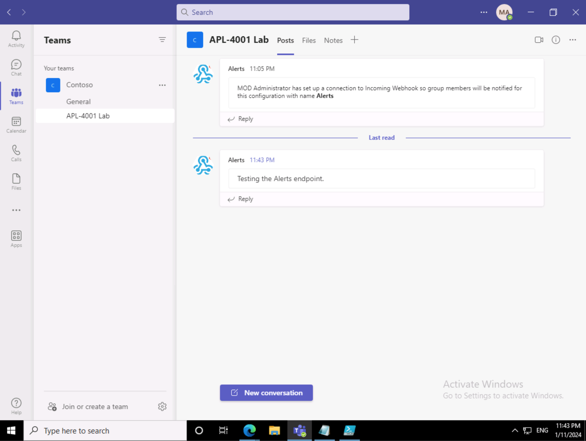

---
lab:
  title: Créer un webhook entrant
  module: Exercise 2
---

# Exercice 2 : Créer un webhook entrant

## Scénario

Supposons que l'équipe d'assistance informatique utilise un service de notification tiers pour gérer les alertes et les messages. Récemment, l'équipe a décidé d'automatiser le processus de publication de messages sur un canal Teams utilisé pour les mises à jour critiques.  Le service tiers est conçu pour envoyer des messages par l’intermédiaire d’un webhook.  

## Tâches de l’exercice

Votre tâche consiste à créer un webhook entrant, nommé **Alertes**, pour recevoir ces messages.  Vous devez également tester le webhook pour vous assurer qu’il peut accepter et afficher un message avec la chaîne `"Testing the Alerts endpoint."` correctement. L’équipe mettra à jour le service avec l’URL du point de terminaison du webhook lorsque vous aurez terminé vos tâches.

Vous devez effectuer les tâches suivantes dans le cadre de l’exercice :

1. Enregistrer un webhook entrant.
2. Postez un message pour tester le webhook.

**Durée prévue :** 8 minutes

## Tâche 1 : Enregistrer un webhook entrant

Commencez par enregistrer un webhook entrant.

**Remarque :** Si le compte Teams que vous utilisez pour cet exercice n’a pas encore d’équipe avec un canal, créez un canal avant d’effectuer les étapes suivantes.

1. Dans Microsoft Teams, naviguez vers un canal où vous pouvez configurer le webhook.
2. Dans le canal, sélectionnez le menu **Autres options**, puis sélectionnez **Connecteurs**.  (Remarque : utilisez le menu à l’intérieur de la chaîne, et non le menu de la liste des chaînes.)
3. Recherchez `"webhook"` puis sélectionnez **Webhook entrant**.

   

4. Sélectionnez **Ajouter**.
5. Dans la page de vue d’ensemble, sélectionnez **Ajouter**.
6. Dans le canal, sélectionnez à nouveau le menu **Autres options**, puis sélectionnez **Connecteurs**.
7. En regard de **Webhook entrant**, sélectionnez **Configurer**.
8. Pour le nom entrez **Alertes**.
9. Sélectionnez **Créer**.  Laissez cette fenêtre ouverte pour pouvoir copier l’URL au cours de la tâche suivante.

Vous avez configuré un Webhook entrant dans le canal.

## Tâche 2 : Postez un message pour tester le webhook

Pour tester le webhook, utilisez PowerShell pour envoyer un message au point de terminaison du webhook.

1. Ouvrez **PowerShell**.
2. Exécutez la commande suivante pour envoyer le message.  Remplacez <YOUR WEBHOOK URL> par l’URL de la fenêtre de configuration du webhook dans Teams provenant de la tâche précédente :

     ```powershell
     Invoke-RestMethod -Method post -ContentType 'Application/Json' -Body '{"text":"Testing the Alerts endpoint."}' -Uri <YOUR WEBHOOK URL>
    ```

## Vérifier votre travail

1. Dans le client Microsoft Teams, accédez à l’onglet **Conversations** du canal configuré.
2. Vérifiez la présence d’un message dans le canal à partir de `Alerts` qui lit `"Testing the Alerts endpoint"`.

 
