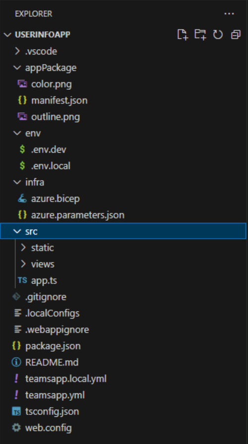
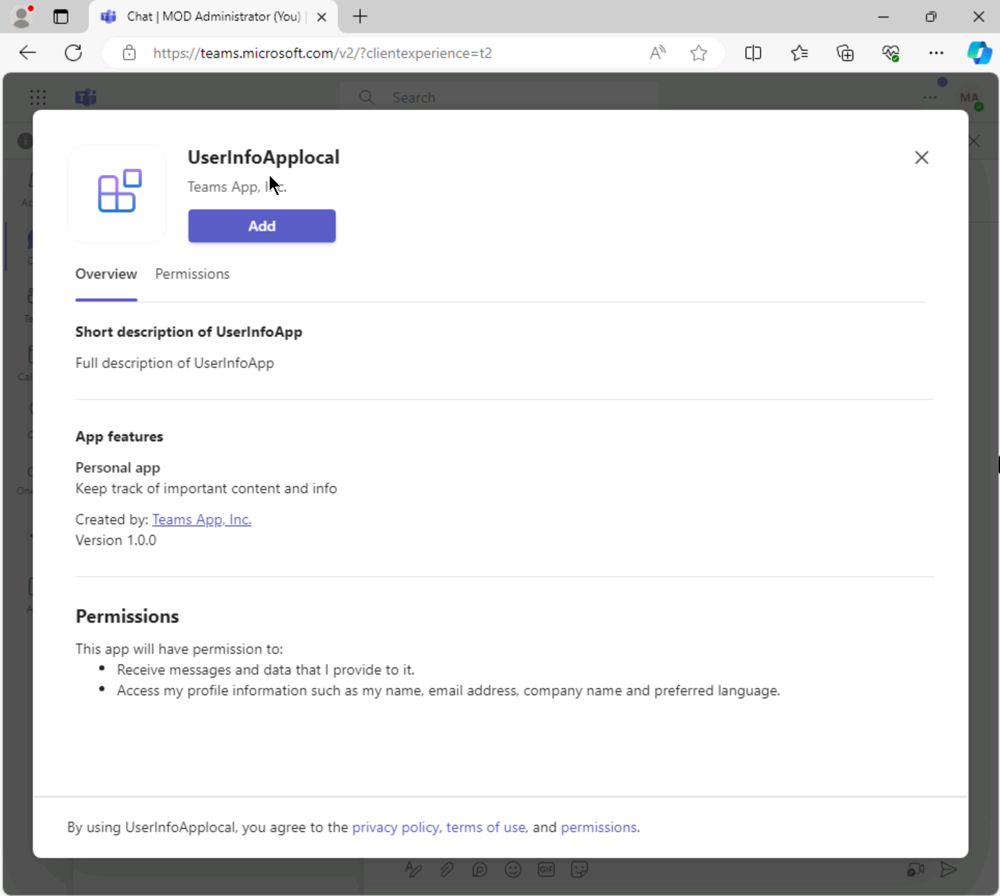
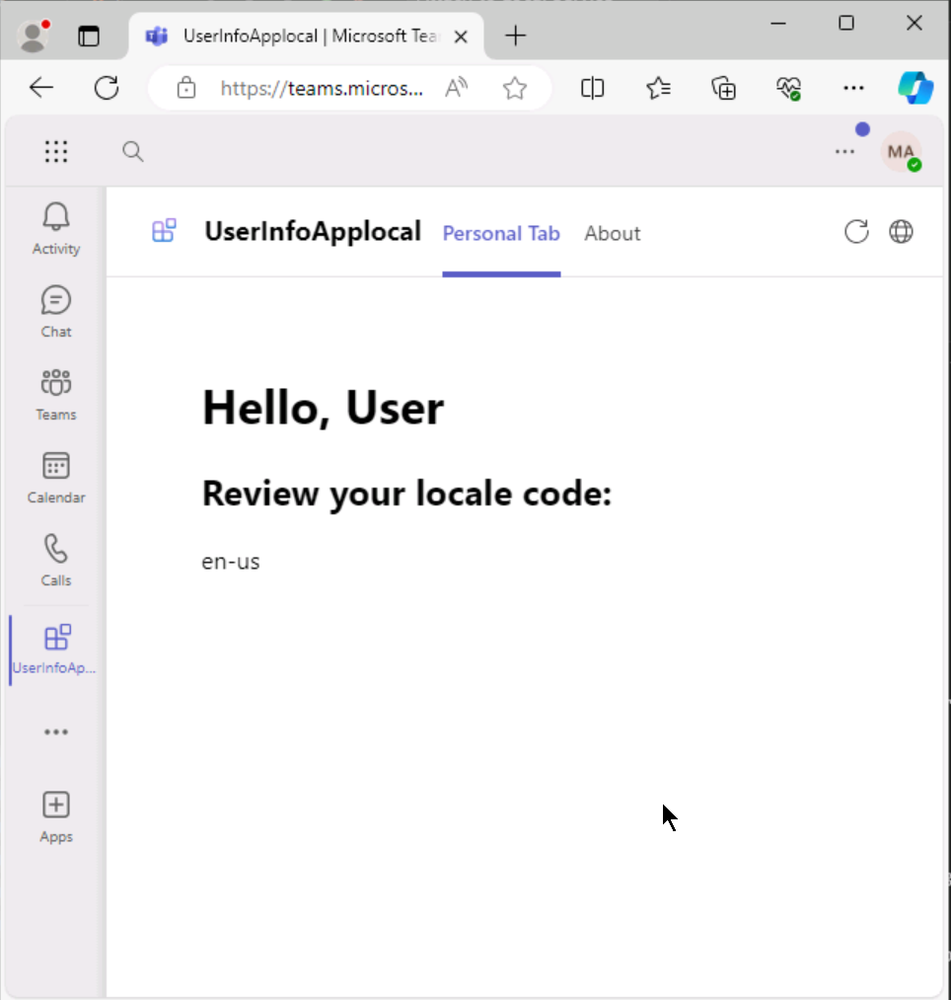

---
lab:
  title: Créer un onglet Teams
  module: Exercise 3
---

# Exercice 3 : Créer un onglet Teams

## Scénario

Supposons que l’équipe de support informatique souhaite créer un onglet Teams pour aider les utilisateurs à accéder aux informations nécessaires quand ils envoient des tickets de support. Par exemple, l’équipe doit afficher les codes de paramètres régionaux des utilisateurs pour le traitement des tickets et la création de rapports. Votre tâche actuelle consiste à créer cet onglet pour afficher le code des paramètres régionaux d’un utilisateur. Des informations supplémentaires seront ajoutées à l’onglet par la suite.

## Tâches de l’exercice

Votre tâche consiste à créer une application d’onglet Teams qui récupère les paramètres régionaux de l’utilisateur, en utilisant le contexte Teams, et les affiche dans un onglet personnel.

Dans le cadre de l’exercice, vous devez effectuer les tâches suivantes :

1. Créer une application d’onglet en utilisant Teams Toolkit pour Visual Studio Code.
1. Mettre à jour l’application pour récupérer et afficher les paramètres régionaux de l’utilisateur.

**Durée prévue :** 10 minutes

## Tâche 1 : Créer une application d’onglet en utilisant Teams Toolkit pour Visual Studio Code

1. Ouvrez Visual Studio Code.
1. Dans la barre latérale, sélectionnez l’icône **Microsoft Teams** pour ouvrir le panneau **TEAMS TOOLKIT**.
1. Sélectionnez **Créer une application**, puis **Onglet**.
1. Sélectionnez **Onglet de base** dans la liste des options disponibles.
1. Pour le langage de programmation, sélectionnez **TypeScript**.
1. Pour le **Dossier de l’espace de travail**, sélectionnez **Dossier par défaut**.
1. Pour le **Nom de l’application**, entrez **UserInfoApp**.

Une notification s’affiche quand tous les dossiers et fichiers ont été automatiquement générés, et une nouvelle instance de Visual Studio Code ouvre le nouveau dossier de projet.

Dans le panneau **EXPLORATEUR**, le dossier *src* contient le code source de votre application. Les fichiers en dehors du dossier *src* sont liés au serveur, comme le bot. 

## Tâche 2 : Mettre à jour l’application pour récupérer et afficher les paramètres régionaux de l’utilisateur

À présent, vous pouvez ajouter les fonctionnalités souhaitées à l’application d’onglet.

1. Accédez au dossier `src` > `views`, puis ouvrez le fichier `hello.html`.
1. Recherchez l’élément `<div>` et mettez-le à jour pour qu’il contienne les éléments suivants entre les balises `<div>` et `</div>` :

    ```html
        <h1>Hello, User</h1>
      <span>
        <h2>Review your locale code:</h2>
        <p id="locale"></p>
      </span>
    ```

1. Accédez au dossier `src` > `static` > `scripts`, puis ouvrez le fichier `teamsapp.js`.
1. Remplacez le contenu du fichier  par le code suivant :

    ```typescript
        (function () {
          "use strict";
        
          // Call the initialize API first
          microsoftTeams.app.initialize().then(function () {
            microsoftTeams.app.getContext().then(function (context) {
              if (context?.app?.locale) {
                updateLocale(context.app.locale);
              }
              else{
                updateLocale("unknown");
              }
            });
          });
        
          function updateLocale(locale) {
            if(locale){
              document.getElementById("locale").innerHTML = locale;
            }
          }
        })();
    ```

    Ce code utilise l’objet de **contexte** pour récupérer les paramètres régionaux de l’utilisateur et met à jour le code HTML pour afficher le code des paramètres régionaux.

## Vérifier votre travail

Exécutez votre application en mode débogage pour tester les fonctionnalités.

1. Dans Visual Studio Code, sélectionnez l’icône **Microsoft Teams** pour ouvrir le panneau **TEAMS TOOKIT**.

2. Commencez à exécuter votre application avec le débogueur attaché en utilisant une de ces méthodes :

   - Sélectionnez la touche F5.
   - Dans Visual Studio Code, accédez au menu **Exécuter et déboguer**.  Sélectionnez **Déboguer dans Teams** avec l’option de navigateur souhaitée, puis sélectionnez le bouton **Démarrer le débogage**.
   - Dans la section **ENVIRONNEMENT** de Teams Toolkit, ouvrez le dossier *local*, puis sélectionnez le navigateur de votre choix.

3. Visual Studio Code effectue des vérifications dont les actions sont visibles sous l’onglet **Console**, puis une nouvelle fenêtre de navigateur s’ouvre. Dans la boîte de dialogue **UserInfoApplocal**, sélectionnez le bouton **Ajouter** pour installer l’application dans Teams et avoir un aperçu. 

L’application est désormais visible dans la barre latérale. L’application est préconfigurée avec deux onglets : **Onglet Personnel** et **À propos de**. Vérifiez que le code des paramètres régionaux s’affiche sous l’onglet. 
